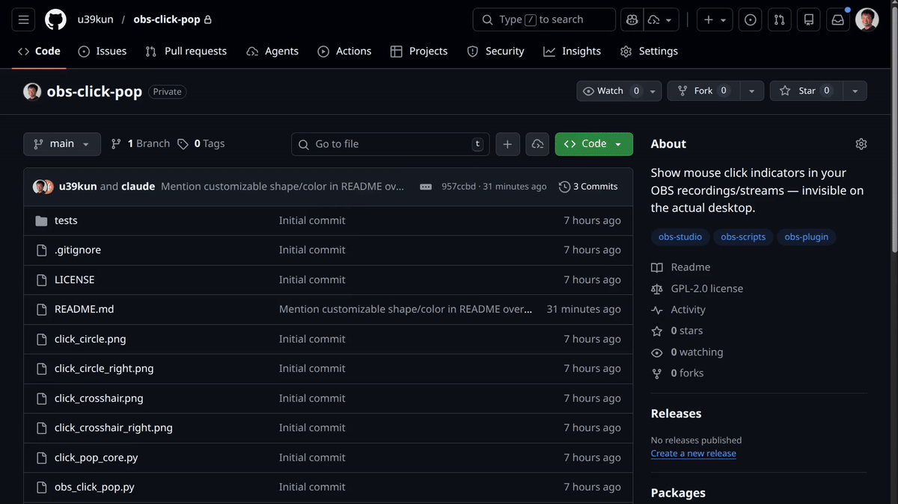

# Click Pop for OBS

Show mouse click indicators **only in your OBS recordings/streams** — invisible on the actual desktop.

By default, left clicks show a red circle and right clicks show a blue circle. Indicators disappear after a configurable duration. Replace the included PNGs with any transparent image to customize the shape, color, and style.



## Why?

Clear to the viewer, no clutter to the demonstrator.
Your viewers will see exactly where you clicked, but you don't see any click overlay in your working space.

## Features

- Left/right click differentiation with customizable indicator images
- Crop-aware coordinate mapping — works correctly when your Display Capture source is cropped via:
  - Source Properties (e.g. XSHM "Crop Left/Top")
  - Edit Transform / Alt-drag
  - Crop/Pad filter
- Auto-detection of Display Capture sources with an editable dropdown
- Correct handling of OBS bounding box scaling modes (Scale Inner, Stretch, etc.)
- Configurable circle size, duration, and max simultaneous circles
- Works on 4K monitors with scaled canvas output

## Files

| File | Purpose |
|------|---------|
| `obs_click_pop.py` | Main OBS Python script |
| `click_pop_core.py` | Pure logic functions (coordinate mapping, slot allocation, expiration) |
| `click_circle.png` | Red circle for left clicks (80x80 transparent PNG) |
| `click_circle_right.png` | Blue circle for right clicks (80x80 transparent PNG) |
| `click_crosshair.png` | Red crosshair for left clicks (80x80 transparent PNG) |
| `click_crosshair_right.png` | Blue crosshair for right clicks (80x80 transparent PNG) |

## Setup

### Prerequisites

- **OBS Studio 30+** (tested with 32.0.2)
- **Python 3.12** (must match the version OBS was built against)
- **pynput** package (installed into the same Python — see platform steps below)

### Windows

1. Install Python 3.12: `winget install Python.Python.3.12`
2. Install pynput: `pip install pynput`
3. In OBS, go to **Tools > Scripts > Python Settings** and set the path to your Python install
   (e.g. `C:\Users\<you>\AppData\Local\Programs\Python\Python312`)

### Linux

On Linux, OBS is linked directly against the system Python at compile time — there is no **Python Settings** tab. Just install pynput into the matching system Python:

```bash
python3.12 -m pip install pynput
```

If your distro's OBS package was built against a different Python version, match that version instead.

### macOS

1. Install Python 3.12 and pynput: `python3.12 -m pip install pynput`
2. In OBS, go to **Tools > Scripts > Python Settings** and set the path to your Python install
3. Grant OBS (or Python) **Accessibility** permissions:
   System Settings > Privacy & Security > Accessibility > add OBS Studio

### Installation

1. Clone or download this repository to a permanent folder
2. In OBS, go to **Tools > Scripts**, click **+** and select `obs_click_pop.py`
3. Configure settings:
   - **Left/Right-click images** — what overlay graphic to use for left and right clicks. By default, red and blue circles are used.
   - **Circle duration** — how long each indicator stays visible (default 350 ms)
   - **Circle diameter** — size in pixels (default 60)
   - **Monitor width/height** — your display resolution (auto-detected)
   - **Max simultaneous circles** — how many indicators can show at once (default 5)
   - **Display Capture source** — select your Display Capture from the dropdown for crop-aware positioning (leave blank if no crop is applied)
4. Click **Start Listener**
5. Start recording — clicks will appear as colored circles in the output

### Cropped Display Capture

If your Display Capture source is cropped to a sub-region of your screen, select it from the **Display Capture source** dropdown. The script reads crop offsets and scale from the source properties, scene-item transform, and any Crop/Pad filters to map mouse coordinates correctly.


## Customization

Replace the PNG files with your own designs. Any transparent PNG works — the script will scale it to the configured circle diameter.


## Platform Support

| Platform | Status | Notes |
|----------|--------|-------|
| Windows | Works | No special setup needed |
| macOS | Works | Requires Accessibility permission |
| Linux (X11) | Works | Standard X11 input capture |
| Linux (Wayland) | Limited | pynput cannot capture global input on pure Wayland; use X11 or XWayland |


## Known Limitations

- No drag visualization (only click points)
- Circle appears at click position instantly (no fade-in/fade-out animation)
- Multi-monitor setups are untested


## How It Works

1. A `pynput` background thread listens for mouse clicks globally
2. Click events are queued and processed by an OBS timer callback (~60 fps)
3. For each click, an OBS Image Source is created/repositioned in the current scene
4. Mouse coordinates are mapped from monitor space to OBS canvas space, accounting for any crop and scale transforms on the Display Capture
5. After the configured duration, the source is hidden
6. The indicators are **composited into the OBS output** — they exist only in the recording


## Developer Notes

### Running Tests

```bash
python -m venv .venv
.venv/bin/pip install pytest          # Windows: .venv\Scripts\pip
.venv/bin/pytest tests/ -v -m "not e2e"  # Windows: .venv\Scripts\pytest
```

The test suite includes:
- **Tier 1** — Pure logic tests (coordinate mapping, slot allocation, circle expiration)
- **Tier 2** — Mock OBS integration tests (positioning, ref management, visibility)
- **E2E stubs** — Marked `@pytest.mark.e2e`, skipped by default (require a running OBS instance)


## License

GPL-2.0
